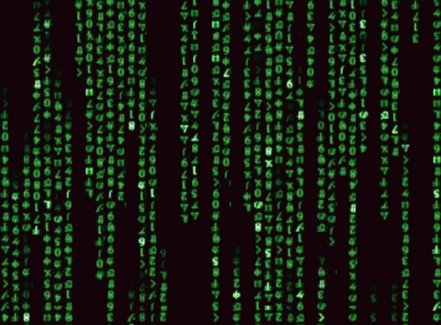

### 👋 Hi there, I’m Param!

- 👀 I work in the domains of Computer Vision, AI, Robotics

    </a> 

- :rocket: Skills

            

<!---
ParamDave5/ParamDave5 is a ✨ special ✨ repository because its `README.md` (this file) appears on your GitHub profile.
You can click the Preview link to take a look at your changes.
--->
